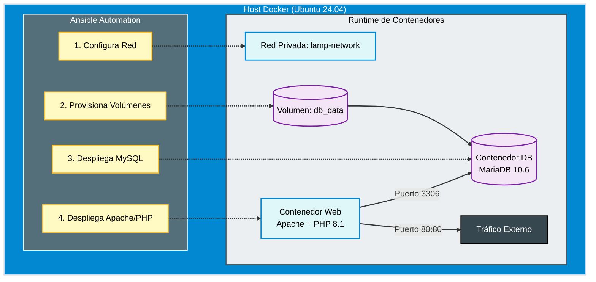

import { Steps } from '@astrojs/starlight/components';

## 📋 Resumen Ejecutivo

Este proyecto aborda la necesidad de estandarizar el despliegue de aplicaciones web basadas en PHP (Legacy) en un entorno moderno. En lugar de configurar servidores manualmente, utilizamos **Ansible** para definir el estado deseado de la infraestructura y **Docker** para encapsular las dependencias de la aplicación.

### 🎯 Objetivos de Ingeniería
1.  **Idempotencia:** Capacidad de ejecutar el despliegue múltiples veces sin duplicar recursos ni generar errores.
2.  **Segregación de Red:** Aislamiento de la base de datos (Backend) del servidor web (Frontend) mediante redes bridge privadas.
3.  **Persistencia:** Gestión de volúmenes Docker para garantizar la durabilidad de los datos de MySQL.

---

## 🏗️ Arquitectura de la Solución

El diseño implementa un patrón de **Sidecar de Datos** y segregación de contenedores gestionados por un controlador externo (Ansible).



---

## 💻 Implementación Técnica (Ansible)

La lógica de despliegue se organiza siguiendo el estándar **SOP-LINUX-ANS-01**, separando inventarios, playbooks y código fuente.

<Steps>

1.  **Configuración del Motor (Ansible Core)**

    Debido a cambios recientes en las colecciones comunitarias, utilizamos una configuración minimalista para garantizar compatibilidad con Python 3.12+.

    ```ini title="ansible.cfg"
    [defaults]
    inventory = ./inventory/dev
    collections_path = ./collections
    host_key_checking = False
    pipelining = True
    # Usamos 'yaml' (short name) para evitar conflictos con plugins legacy
    stdout_callback = yaml

    [privilege_escalation]
    become = True
    become_method = sudo
    become_user = root
    become_ask_pass = False
    ```

    Declaramos únicamente las dependencias estrictamente necesarias para evitar "bloatware" o conflictos.

    ```yaml title="requirements.yml"
    ---
    collections:
      - name: community.docker
        version: 3.10.1
      - name: ansible.posix
        version: 1.5.4
    ```

2.  **Definición del Inventario**

    ```ini title="inventory/dev"
    [app_servers]
    192.168.1.60 ansible_user=dzamo ansible_ssh_private_key_file=~/.ssh/id_rsa
    ```

3.  **Estructura del Playbook**
    
    > **Nota:** Al ejecutar desde la carpeta `playbooks/`, la ruta al código fuente se ajusta a `../src`.

    ```yaml title="playbooks/deploy-lamp.yml"
    ---
    - name: Aprovisionamiento de Stack LAMP
      hosts: app_servers
      become: true
      vars:
        project_name: "intranet-core"
        mysql_root_pass: "SecureRoot123!"
        mysql_db: "intranet_db"
        mysql_user: "app_user"
        mysql_pass: "AppPass2025"
        
      tasks:
        - name: Crear Red Docker Aislada
          community.docker.docker_network:
            name: "{{ project_name }}-net"
            driver: bridge

        - name: Crear Volumen de Persistencia DB
          community.docker.docker_volume:
            name: "{{ project_name }}-db-data"

        - name: Desplegar Base de Datos (MariaDB)
          community.docker.docker_container:
            name: "{{ project_name }}-db"
            image: mariadb:10.6
            state: started
            restart_policy: always
            networks:
              - name: "{{ project_name }}-net"
            env:
              MARIADB_ROOT_PASSWORD: "{{ mysql_root_pass }}"
              MARIADB_DATABASE: "{{ mysql_db }}"
              MARIADB_USER: "{{ mysql_user }}"
              MARIADB_PASSWORD: "{{ mysql_pass }}"
            volumes:
              - "{{ project_name }}-db-data:/var/lib/mysql"
            labels:
              com.role: "database"

        - name: Desplegar Servidor Web (Apache+PHP)
          community.docker.docker_container:
            name: "{{ project_name }}-web"
            image: php:8.1-apache
            state: started
            restart_policy: always
            ports:
              - "80:80"
            networks:
              - name: "{{ project_name }}-net"
            volumes:
              - ../src:/var/www/html
            labels:
              com.role: "frontend"
    ```

3.  **Código de la Aplicación (Prueba de Concepto)**

    Ubicado en la raíz del proyecto para facilitar su edición. Inyectamos un script PHP que valida la conexión DNS interna.

    ```php title="src/index.php"
    <?php
    $servername = "intranet-core-db"; // Resolución DNS interna de Docker
    $username = "app_user";
    $password = "AppPass2025";

    // Crear conexión
    $conn = new mysqli($servername, $username, $password);

    // Verificar
    if ($conn->connect_error) {
        die("❌ Fallo de conexión: " . $conn->connect_error);
    }
    echo "✅ Conectado exitosamente a MariaDB desde Apache Container.";
    ?>
    ```

4.  **Ejecución y Verificación**

    ```bash
    # Instalación de dependencias (Solo la primera vez)
    ansible-galaxy install -r requirements.yml
    
    # Ejecución
    ansible-playbook playbooks/deploy-lamp.yml
    ```

</Steps>

## 🔍 Análisis de Valor

La transición de scripts manuales de Bash a Ansible para este despliegue proporciona:

| Característica | Script Bash Tradicional | Ansible + Docker |
| :--- | :--- | :--- |
| **Control de Estado** | Imperativo (Difícil saber si falló a medias) | Declarativo (Asegura el estado final) |
| **Limpieza** | Manual (Riesgo de residuos) | Gestión nativa del ciclo de vida del contenedor |
| **Portabilidad** | Atado al OS del Host | Ejecutable en cualquier Host con Docker Engine |

### Próximos Pasos (Roadmap AZ-104)

Este proyecto sirve como base para la siguiente fase de migración a la nube:
1.  **Lift & Shift:** Reutilizar este Playbook para aprovisionar una VM Ubuntu en **Azure Compute**.
2.  **Database Migration:** Desacoplar el contenedor de MariaDB y conectar la App a **Azure Database for MariaDB**.
