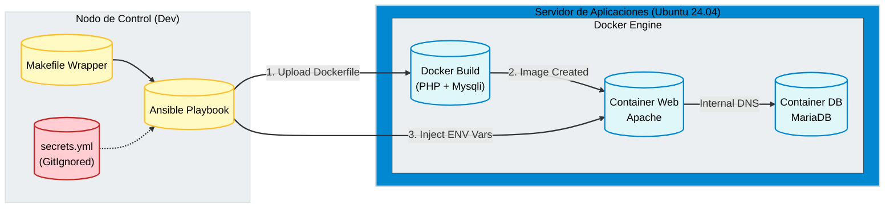

import { Steps } from '@astrojs/starlight/components';

## 📋 Resumen Ejecutivo

Este proyecto moderniza el despliegue de aplicaciones PHP (Legacy), evolucionando de una configuración manual a una **Infraestructura Inmutable**. A diferencia de los despliegues básicos de contenedores, esta solución aborda problemas del mundo real: la necesidad de compilar extensiones de PHP personalizadas (`mysqli`), la gestión segura de credenciales fuera del código y la estandarización del entorno de desarrollo.

### 🎯 Objetivos de Ingeniería
1.  **Inmutabilidad:** Construcción de imágenes Docker personalizadas (*custom builds*) en tiempo de despliegue para inyectar dependencias del sistema.
2.  **Seguridad (12-Factor App):** Desacoplamiento total de credenciales. El código fuente no contiene secretos; estos se inyectan como variables de entorno.
3.  **Estandarización:** Implementación de un `Makefile` como wrapper para abstraer la complejidad de Python/Ansible y facilitar el *onboarding*.

---

## 🏗️ Arquitectura de la Solución

El diseño implementa un patrón de **Build & Deploy Remoto** orquestado por Ansible. El nodo de control prepara la configuración y los secretos, mientras que el host remoto construye y ejecuta los contenedores.



---

## 💻 Implementación Técnica

La solución utiliza una estructura profesional que separa configuración, secretos y lógica de despliegue.

<Steps>

1.  **Wrapper de Ejecución (Makefile)**

    Para evitar problemas de versiones y entornos virtuales, encapsulamos los comandos en un `Makefile`. Esto garantiza que cualquier desarrollador use las mismas herramientas.

    ```makefile title="Makefile"
    setup:
        python3 -m venv .venv
        .venv/bin/pip install ansible-core docker
        .venv/bin/ansible-galaxy install -r requirements.yml

    deploy:
        .venv/bin/ansible-playbook playbook/deploy-lamp.yml
    ```

2.  **Gestión de Secretos (Patrón de Sobreescritura)**

    Ansible carga primero las variables públicas (`all.yml`) y luego sobreescribe con un archivo de secretos local que está excluido de Git (`.gitignore`).

    ```yaml title="playbook/deploy-lamp.yml"
    - hosts: app_servers
      vars_files:
        - "../group_vars/all.yml"      # Estructura pública (Placeholders)
        - "../group_vars/secrets.yml"  # Secretos locales (Real Passwords)
    ```

3.  **Lógica del Playbook (Build & Run)**

    El playbook no solo descarga imágenes, sino que sube un `Dockerfile` y compila una imagen personalizada para soportar `mysqli`.

    ```yaml title="playbook/deploy-lamp.yml"
    tasks:
      - name: Construir imagen PHP personalizada
        community.docker.docker_image:
          name: "{{ custom_image_name }}"
          tag: latest
          build:
            path: "{{ remote_project_path }}" # Ruta remota del Dockerfile
          source: build
          force_source: true

      - name: Desplegar Web Container
        community.docker.docker_container:
          name: "{{ project_name }}-web"
          image: "{{ custom_image_name }}:latest" # Usamos la imagen recién creada
          env:
            # Inyección segura de variables de entorno
            DB_HOST: "{{ project_name }}-db"
            DB_USER: "{{ mysql_user }}"
            DB_PASSWORD: "{{ mysql_pass }}"
    ```

4.  **Código Agnóstico (PHP)**

    El código fuente (`src/index.php`) no contiene ninguna credencial. Lee la configuración del entorno, cumpliendo con los principios de *The Twelve-Factor App*.

    ```php title="src/index.php"
    <?php
    // Lectura segura desde variables de entorno
    $servername = getenv('DB_HOST');
    $username = getenv('DB_USER');
    $password = getenv('DB_PASSWORD');

    $conn = new mysqli($servername, $username, $password, $dbname);
    
    if ($conn->connect_error) {
        die("❌ Fallo de conexión: " . $conn->connect_error);
    }
    echo "✅ Conectado exitosamente a MariaDB.";
    ?>
    ```

5.  **Ejecución Estandarizada**

    Gracias al Makefile, el despliegue se reduce a dos comandos, independientemente de la complejidad subyacente.

    ```bash
    # Inicialización (Solo la primera vez)
    make setup

    # Despliegue idempotente
    make deploy
    ```

</Steps>

## 🔍 Análisis de Valor

| Característica | Script Bash Tradicional | Ansible + Docker Pro |
| :--- | :--- | :--- |
| **Credenciales** | Hardcoded en archivos (`.php`) | Inyectadas en Memoria (ENV) |
| **Dependencias** | Instalación manual (`apt-get`) | Docker Build Automático |
| **Portabilidad** | "Funciona en mi máquina" | Estandarizado vía Makefile |

### Próximos Pasos (Roadmap AZ-104)

Este proyecto sirve como base para la migración a la nube. Hemos documentado este proceso en la sección de Operaciones Cloud:

1. **Migración IaaS:** Replicar esta arquitectura utilizando Máquinas Virtuales en Azure.
    - **[👉 Ver Escenario 01: Migración LAMP a Azure IaaS](/es/az-cloud-ops/compute/scenario-01-lamp-iaas/)**
    
2. **Azure Container Registry (ACR):** Mover el proceso de *build* a la nube.
3. **Azure Key Vault:** Gestión de secretos centralizada.
