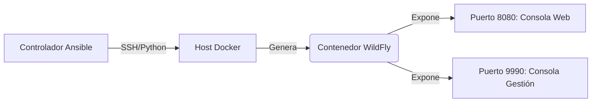

import { Steps, FileTree } from '@astrojs/starlight/components';

## 🚀 Escenario de Negocio

En entornos empresariales (como sectores Bancario o Telecomunicaciones), desplegar manualmente Servidores de Aplicaciones (Middleware) conduce a deriva de configuración e inconsistencias de seguridad.

Este proyecto demuestra una **Estrategia de Modernización**: cambiar de la instalación manual de **JBoss/WildFly** en bare metal a un despliegue automatizado y en contenedores orquestado por **Ansible**.

### Objetivos Arquitectónicos
1.  **Inmutabilidad:** Usar Docker para asegurar que el runtime del servidor de aplicaciones sea idéntico en todos los entornos.
2.  **Automatización:** Usar Ansible para manejar el ciclo de vida del contenedor y la inyección de configuración.
3.  **Estándares:** Desplegar la última versión estable de WildFly reemplazando instancias propietarias legacy de JBoss.

---

## 🛠️ Diseño de Infraestructura

La solución utiliza un Nodo Controlador (Ansible) apuntando a un Host Docker para provisionar el servicio de middleware.



### Prerequisitos
*   **Host:** Ubuntu 24.04 (Host Docker).
*   **Controlador:** Estación de Trabajo Linux / WSL2 con Ansible instalado.
*   **Colección:** `community.docker` instalada en el controlador.

---

## 💻 Detalles de Implementación

<Steps>

1.  **Definir el Inventario**

    Tratamos la infraestructura como código. El inventario define el host Docker objetivo.

    ```ini title="inventory.ini"
    [middleware_hosts]
    192.168.1.50 ansible_user=dzamo ansible_python_interpreter=/usr/bin/python3
    ```

2.  **El Playbook de Ansible**

    Este playbook asegura que el servicio Docker esté activo, descarga la imagen oficial de WildFly y la despliega con usuarios de gestión específicos definidos como variables de entorno.

    ```yaml title="deploy-wildfly.yml"
    ---
    - name: Provisionar Stack de Middleware (WildFly)
      hosts: middleware_hosts
      become: true
      vars:
        wildfly_version: "24.0.0.Final"
        container_name: "wildfly-prod-01"
        mgmt_user: "admin"
        mgmt_pass: "SecurePass123!"

      tasks:
        - name: Asegurar que el SDK Docker de Python esté presente
          apt:
            name: python3-docker
            state: present
            update_cache: yes

        - name: Descargar Imagen de WildFly
          community.docker.docker_image:
            name: "quay.io/wildfly/wildfly:{{ wildfly_version }}"
            source: pull

        - name: Desplegar Contenedor WildFly
          community.docker.docker_container:
            name: "{{ container_name }}"
            image: "quay.io/wildfly/wildfly:{{ wildfly_version }}"
            state: started
            restart_policy: always
            ports:
              - "8080:8080" # Puerto App
              - "9990:9990" # Puerto Gestión
            command: /opt/jboss/wildfly/bin/standalone.sh -b 0.0.0.0 -bmanagement 0.0.0.0
            env:
              WILDFLY_USERNAME: "{{ mgmt_user }}"
              WILDFLY_PASSWORD: "{{ mgmt_pass }}"
            labels:
              environment: "production"
              stack: "java-middleware"

        - name: Esperar Interface de Gestión
          wait_for:
            host: "127.0.0.1"
            port: 9990
            delay: 10
    ```

3.  **Ejecución y Validación**

    Ejecutar el playbook aplica el estado de forma idempotente.

    ```bash
    ansible-playbook -i inventory.ini deploy-wildfly.yml
    ```

    **Verificación:**
    Accede a la Consola de Gestión de WildFly vía navegador en `http://<HOST_IP>:9990`.

</Steps>

## 🔍 Análisis Técnico Profundo

### ¿Por qué este enfoque?
Tradicionalmente, los SysAdmins descomprimirían el `tar.gz` de JBoss, editarían `standalone.xml` manualmente y crearían unidades `systemd`. Este playbook reemplaza ~40 pasos manuales con una única definición codificada.

*   **Seguridad:** Las credenciales se inyectan vía variables (y pueden cifrarse con Ansible Vault).
*   **Redes:** Vinculamos `-b 0.0.0.0` explícitamente para permitir acceso externo al contenedor, un problema común en middleware contenedorizado.

### Hoja de Ruta Futura
*   **Integración Azure:** Publicar esta imagen a **Azure Container Registry (ACR)**.
*   **Clustering:** Configurar WildFly en Modo Dominio usando JGroups/TCPPing para Alta Disponibilidad.
