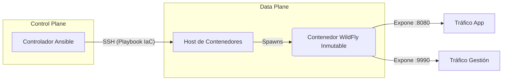

import { Steps, FileTree } from '@astrojs/starlight/components';

## 📋 Resumen Ejecutivo

En infraestructuras críticas (Banca y Telco), la gestión tradicional de servidores de aplicaciones basada en *scripts* manuales o "Pets" conlleva riesgos inaceptables: **deriva de configuración**, **vulnerabilidades de seguridad** no parcheadas y un **Time-to-Market** lento para nuevas features.

Este proyecto implementa una estrategia de **Modernización de Infraestructura** migrando cargas de trabajo legacy de JBoss/WildFly hacia una arquitectura inmutable basada en contenedores.

### 🎯 Objetivos de la Solución
*   **Integridad Operacional:** Garantizar que el artefacto desplegado en Desarrollo es bit a bit idéntico al de Producción (Paridad de Entornos).
*   **Seguridad por Diseño:** Inyección de secretos en tiempo de ejecución, evitando credenciales hardcodeadas en archivos XML.
*   **Recuperación ante Desastres (DR):** Reducción del RTO (Recovery Time Objective) de horas a segundos mediante el redespilegue automatizado.

---

## 🏗️ Arquitectura y Decisiones de Diseño

La solución desacopla el *runtime* (WildFly) de la configuración, orquestado por un controlador centralizado.



### Principios Técnicos Aplicados
1.  **Inmutabilidad (Docker):** Se abandonan las actualizaciones "in-place" (yum update). Cada despliegue destruye el contenedor anterior y levanta una versión limpia y aprobada.
2.  **Idempotencia (Ansible):** El playbook puede ejecutarse N veces sin causar efectos secundarios adversos, garantizando el estado deseado.
3.  **12-Factor App:** La configuración específica del entorno (usuarios, contraseñas, memoria JVM) se inyecta vía **Variables de Entorno**, no editando el `standalone.xml`.

---

## 💻 Implementación Técnica

<Steps>

1.  **Definición del Inventario (IaC)**

    El inventario segrega los entornos, permitiendo aplicar políticas diferentes a `staging` y `production` desde una única base de código.

    ```ini title="inventory.ini"
    [middleware_nodes]
    # Nodo objetivo con rol de Host de Contenedores
    192.168.1.50 ansible_user=dzamo ansible_python_interpreter=/usr/bin/python3
    ```

2.  **Playbook de Aprovisionamiento**

    Este artefacto automatiza el ciclo de vida completo. Nótese el uso de `restart_policy: always` para resiliencia automática ante fallos del daemon.

    ```yaml title="deploy-wildfly.yml"
    ---
    - name: Orquestación de Stack Middleware (WildFly)
      hosts: middleware_nodes
      become: true
      vars:
        # Versionado estricto para evitar actualizaciones accidentales
        wildfly_tag: "24.0.0.Final"
        container_name: "wildfly-prod-core"
        # En producción, estos valores vendrían de Ansible Vault
        mgmt_user: "admin_ops"
        mgmt_pass: "{{ vault_mgmt_pass | default('SecurePass123!') }}"

      tasks:
        - name: Verificación de Prerrequisitos (Python SDK)
          apt:
            name: python3-docker
            state: present
            update_cache: yes
            cache_valid_time: 3600

        - name: Pull de Imagen Base Aprobada
          community.docker.docker_image:
            name: "quay.io/wildfly/wildfly:{{ wildfly_tag }}"
            source: pull

        - name: Despliegue de Contenedor (Runtime)
          community.docker.docker_container:
            name: "{{ container_name }}"
            image: "quay.io/wildfly/wildfly:{{ wildfly_tag }}"
            state: started
            restart_policy: always
            ports:
              - "8080:8080" # Tráfico HTTP
              - "9990:9990" # Consola JBoss CLI
            # Binding a 0.0.0.0 es necesario en contenedores para exposición externa
            command: /opt/jboss/wildfly/bin/standalone.sh -b 0.0.0.0 -bmanagement 0.0.0.0
            env:
              WILDFLY_USERNAME: "{{ mgmt_user }}"
              WILDFLY_PASSWORD: "{{ mgmt_pass }}"
            labels:
              com.company.env: "production"
              com.company.service: "middleware-core"

        - name: Validación de Salud del Servicio (Healthcheck)
          wait_for:
            host: "127.0.0.1"
            port: 9990
            delay: 5
            timeout: 60
    ```

3.  **Ejecución y Verificación**

    ```bash
    ansible-playbook -i inventory.ini deploy-wildfly.yml
    ```

</Steps>

## 🔍 Análisis de Valor e Impacto

La implementación de este flujo automatizado reemplaza un procedimiento manual de **~40 pasos** documentados en Word/Excel, logrando:

| Métrica | Antes (Manual) | Después (Automatizado) |
| :--- | :--- | :--- |
| **Tiempo de Aprovisionamiento** | 4 Horas | < 2 Minutos |
| **Error Humano** | Alto Riesgo | Eliminado (Idempotente) |
| **Escalabilidad** | Lineal (1 admin por N servidores) | Exponencial |

### Siguientes Pasos (Roadmap)
*   **Hardening:** Implementación de escaneo de vulnerabilidades en la imagen (Trivy/Clair) en el pipeline CI.
*   **Alta Disponibilidad:** Evolución hacia un Clúster JBoss en Modo Dominio utilizando **JGroups con TCPPING** para entornos sin multicast.
