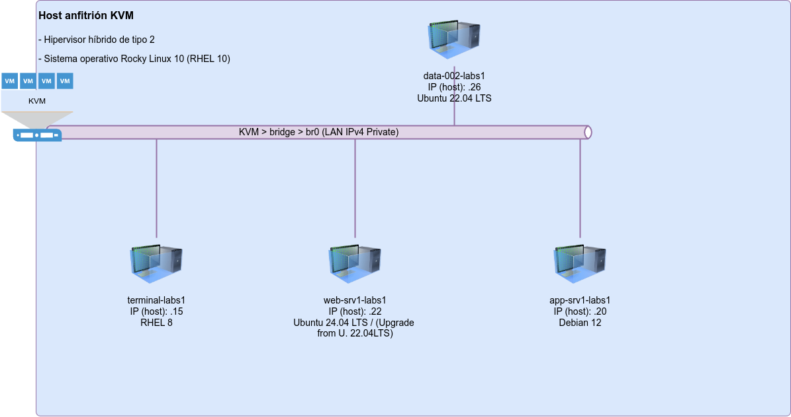

## 🚀 Welcome to LFCS Labs Set I

This lab contains **20 practical Linux questions** designed to prepare you for the LFCS certification.

### 🖥️ Lab Environment

You have access to these servers:
- `terminal-lab1` (default)
- `web-srv1-lab1`, `app-srv1-lab1` 
- ~~`data-001-lab1`~~, `data-002-lab1`

### 📋 Instructions

- Questions specify which server to use
- Save files to `/opt/course/*` when requested  
- Connect via: `ssh server-name`
- All addresses in `/etc/hosts`

### 🎯 Quick Start

Choose any question from the sidebar to begin practicing. Start with **Question 1** for the best learning experience.
