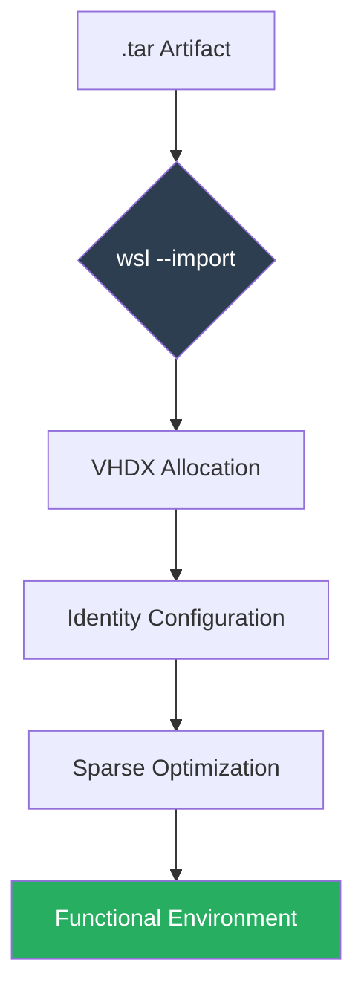

import { Steps, Aside, Badge, LinkCard, CardGrid } from '@astrojs/starlight/components';

This protocol describes the reconstruction of Linux instances using `.tar` artifacts. This is the critical step after a host migration or a disaster recovery (DR) event.

<Badge text="Scenario: Recovery / Migration" variant="success" /> <Badge text="Host: Windows 10/11" variant="note" />

---

## 🔄 Operational Reconstruction Workflow

Deployment is more than just importing data; it requires filesystem rehydration and user identity reconfiguration to become fully operational.



---

## 🛠️ Deployment Procedure

Follow these steps from a **PowerShell 7** terminal with write permissions on the destination drive.

<Steps>

1.  **Importing the Distribution**
    
    Define the instance name, the VHDX residence directory, and the source file.

    ```powershell
    # Define instances path (Storage Tier)
    $installRoot = "D:\WSL\instances"

    # Import instance (Example: Ubuntu)
    wsl --import Ubuntu "$installRoot\Ubuntu" ".\Ubuntu.tar" --version 2
    ```

2.  **Resetting Default User**
    
    <Aside type="caution" title="Post-Import Behavior">
    By design, WSL starts as `root` after an import. To return to your operational user (e.g., `dzamo`), you must declare the identity.
    </Aside>

    Enter the instance and generate the configuration file:
    ```bash
    # Execute inside Linux
    sudo tee /etc/wsl.conf <<EOF
    [user]
    default=dzamo
    EOF
    ```
    *Note: Run `wsl --terminate <distro>` in PowerShell to apply changes.*

3.  **Enable Dynamic Storage (Sparse)**
    
    To prevent the `.vhdx` file from reserving unnecessary space on the host, enable *sparse* mode.

    ```powershell
    wsl --manage Ubuntu --set-sparse true
    ```

</Steps>

---

## 🔍 Verification & Integrity

Validate that the WSL inventory reflects the correct states and the use of Version 2 architecture:

```powershell
wsl --list --verbose
```

| Parameter | Expected Value |
| :--- | :--- |
| **Version** | 2 |
| **Status** | Stopped / Running |
| **User** | Non-root (validated via `whoami`) |

---

## 🔗 Series Articles

<CardGrid>
  <LinkCard 
    title="SOP: Base Export" 
    description="How to capture the RootFS before migration." 
    href="/en/tech-notes/howto/wsl-export-guide/" 
  />
  <LinkCard 
    title="Microsoft Documentation" 
    description="WSL import commands." 
    href="https://learn.microsoft.com/en-us/windows/wsl/basic-commands#import-a-distribution" 
  />
</CardGrid>

**Author:** `dzamo-sysadmin` | **Status:** Operational post-migration
