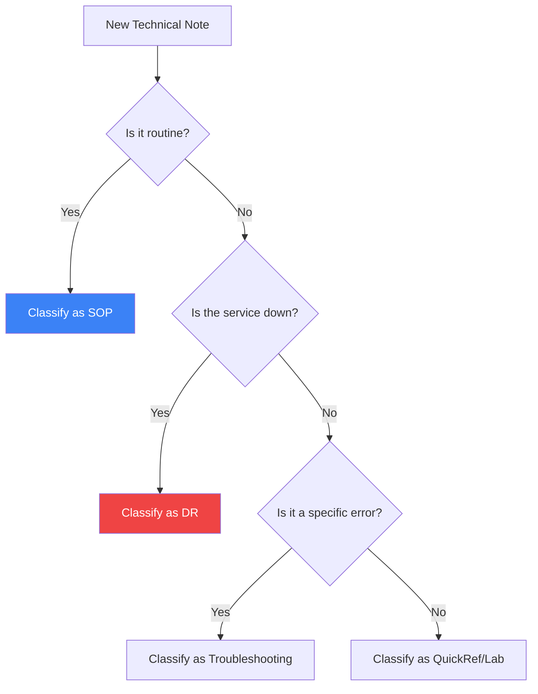

import { Steps, Aside, Badge, LinkCard, CardGrid, Icon } from '@astrojs/starlight/components';

In a **SysAdmin & DevOps** environment, documentation quality determines the speed of incident response. This site uses a semantic categorization system to differentiate the type of intervention required.

---

## 🏷️ Content Taxonomy

We use specific badges to classify the criticality level and purpose of each technical note.

<CardGrid>
  <LinkCard 
    title="SOP (Standard Operating Procedure)" 
    description="Preventive and routine procedures to maintain system health."
    href="#preventive-sop"
  />
  <LinkCard 
    title="DR (Disaster Recovery)" 
    description="Emergency reactive protocols to restore failed services."
    href="#reactive-dr"
  />
</CardGrid>

### Technical Definitions

| Acronym | Meaning | Practical Application |
| :--- | :--- | :--- |
| **SOP** | Standard Operating Procedure | Installations, scheduled backups, hardening. |
| **DR** | Disaster Recovery | Restoration after data loss, emergency migration. |
| **TRB** | Troubleshooting | Resolution of specific errors or detected bugs. |
| **LAB** | Laboratory | Proof of Concepts (PoC) and experimental environments. |

---

## 🛠️ Choosing the Right Framework

To maintain consistency, every new note on this site must follow this decision workflow:

---

## 🚀 Implementation on this Site

You can see these standards applied in the following WSL series guides:

<Steps>

1.  **Preventive Phase (SOP):**
    Generating consistent file system backups.
    <LinkCard 
      title="View SOP: WSL Export" 
      href="/en/tech-notes/howto/wsl-export-guide/" 
      icon="save"
    />

2.  **Recovery Phase (DR):**
    Restoring the environment after migration or system failure.
    <LinkCard 
      title="View DR: WSL Restoration" 
      href="/en/tech-notes/howto/wsl-restoration-guide/" 
      icon="refresh"
    />

</Steps>

<Aside type="tip" title="Continuous Improvement">
A well-executed **SOP** reduces the probability of having to execute a **DR**. Automation (IaC) is the bridge between both categories.
</Aside>

---

**Author:** `dzamo-sysadmin` | **Revision:** 2026.1 | **Category:** Governance
