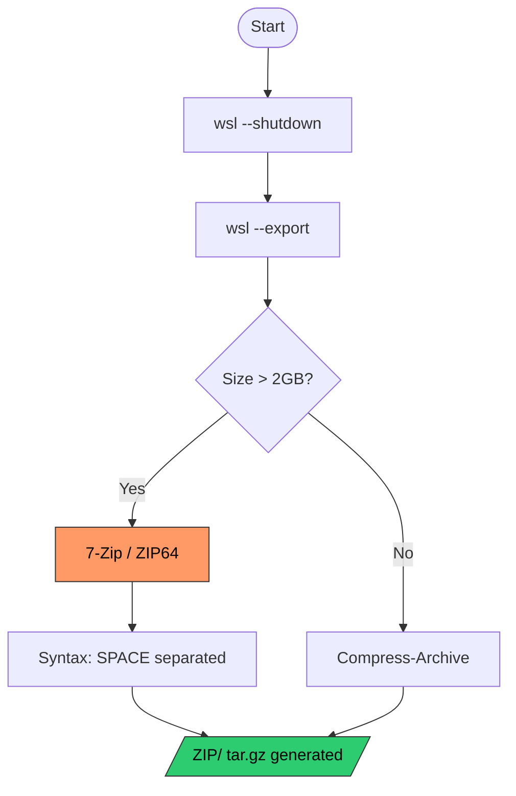

import { Steps, Aside, LinkCard, CardGrid, Badge } from '@astrojs/starlight/components';

When WSL distributions exceed **2GB**, the native Windows `Compress-Archive` command fails due to Zip32 standard limitations. For production environments, it is imperative to use **ZIP64** compliant tools such as **7-Zip**.

<Aside type="danger" title="Critical I/O Error">
`System.IO.IOException: Stream was too long.`  
If you encounter this error in PowerShell, it confirms you are trying to process a volume that exceeds the capacity of native tools.
</Aside>

---

## 🔄 Robust Packaging Workflow

The following decision logic ensures that the export and compression process maintains data integrity based on the artifact size.



---

## 🛠️ Execution Procedure (PowerShell 7)

When invoking external binaries like `7z.exe`, PowerShell handles arguments differently than cmdlets. Using an **Array Pattern** is the recommended practice to avoid parsing errors.

<Steps>

1.  **Data Consistency**
    
    Ensure the `.vhdx` file is not locked by stopping the subsystem.
    ```powershell
    wsl --shutdown
    ```

2.  **File Inventory Preparation**
    
    Define paths in an array. PowerShell will automatically expand this object using spaces when invoking the binary.
    ```powershell
    $dest = "D:\10_Hot-Tier_Caliente\WSL\backups"
    
    $bundleFiles = @(
        "$dest\Ubuntu.tar",
        "$env:APPDATA\alacritty\alacritty.toml",
        "$dest\README_Ubuntu.md"
    )
    ```

3.  **Compression with 7-Zip**
    
    Direct invocation ensuring `7z.exe` is in the system PATH.
    ```powershell
    7z.exe a -tzip "$dest\WSL_Ubuntu_Migration.zip" $bundleFiles
    ```

</Steps>

---

## ⚠️ Syntax Troubleshooting

| Identified Error | Root Cause | Corrective Action |
| :--- | :--- | :--- |
| `Stream was too long` | Zip32 Limit (2GB). | Migrate to **7-Zip** or **tar.exe**. |
| `Syntax is incorrect` | Use of commas (`,`) in 7z. | Replace commas with **spaces**. |
| `Scan WARNINGS` | Paths with spaces incorrectly quoted. | Enclose variables in double quotes. |

---

## 🔗 Cross References

<CardGrid>
  <LinkCard 
    title="SOP: Base Export" 
    description="Requirements for generating the initial .tar file." 
    href="/en/tech-notes/howto/wsl-export-guide/" 
  />
  <LinkCard 
    title="7-Zip Official" 
    description="Download the latest ZIP64 compliant binary." 
    href="https://www.7-zip.org/" 
  />
</CardGrid>

:::tip[Verification Tip]
Always confirm the final bundle size:  
`Get-ChildItem "$dest\*.zip" | Select-Object Name, @{N="GB"; E={$_.Length / 1GB}}`
:::

---
**Generated by:** dzamo-sysadmin | **Version:** 1.1 | **Syntax:** Fixed for Mermaid
