import { Steps, Aside, Badge, LinkCard, CardGrid } from '@astrojs/starlight/components';

This workflow establishes a secure transport mechanism to move files from a local workstation (**Hot-Tier**) to a remote storage node (**Cold-Tier**) based on Rocky Linux.

<Badge text="Source: Windows 11 (ASPIRE)" variant="note" /> <Badge text="Destination: Rocky Linux (victus)" variant="success" />

---

## 📐 Data Link Architecture

To generalize this procedure, we use the `10.0.0.0/8` network segment. Traffic travels encapsulated via SSH to ensure data integrity and security.

```mermaid
graph LR
    subgraph Local_Host ["Windows 11 (Source)"]
        A["💻 ASPIRE-A315-59<br/>IP: 10.0.0.40"]
        D1["📁 D:\_Inbox"]
        D2["📁 D:\WSL\Backups"]
    end

    subgraph Network ["Transport Layer"]
        B["📡 Router (Gateway)<br/>10.0.0.1"]
    end

    subgraph Remote_Host ["Rocky Linux (Cold-Tier)"]
        C["🐧 victus<br/>IP: 10.0.0.50"]
        Dest["🗄️ /var/extra/cold_tier/..."]
    end

    A -- "rsync via SSH" --> B
    B --> C
    C --> Dest

    style A fill:#0078d4,color:#fff
    style C fill:#10b981,color:#fff
    style B stroke-dasharray: 5 5
```



---

## 🛠️ Setup and Deployment

### 1. Environment Preparation
Both systems must have `rsync` version 3.x to support modern protocols and delta-transfer.

*   **On Windows:** It is recommended to use the version included in *Git for Windows* or *MSYS2*.
*   **On Rocky Linux:** Install via `dnf install rsync`.

### 2. Execution of the Transfer

<Steps>

1.  **Windows Path Mapping**
    When using `rsync` on Windows (via Bash/PowerShell), drive letters must be addressed in POSIX format:
    *   `D:\_Inbox` $\rightarrow$ `/d/_Inbox`
    *   `D:\10_Hot-Tier_Caliente\...` $\rightarrow$ `/d/10_Hot-Tier_Caliente/...`

2.  **Synchronization Command**
    Run the following block from the Windows terminal to start the transport:

    ```bash
    # Syncing Inbox and WSL Backups
    rsync -avzP --relative \
      /d/_Inbox \
      /d/10_Hot-Tier_Caliente/WSL/Backups \
      dzamo@10.0.0.50:/var/extra/cold_tier/2026-01-29_ASPIRE-A315-59.win11_backup/_D
    ```

3.  **Flags Explanation**
    *   `-a`: Archive mode (preserves permissions and timestamps).
    *   `-v`: Verbose (shows progress).
    *   `-z`: Compression during transport.
    *   `-P`: Keeps partially transferred files and shows progress bar.

</Steps>

---

## ⚠️ Security Considerations

<Aside type="caution" title="Rocky Linux Permissions">
Ensure that the user `dzamo` has write permissions in `/var/extra/cold_tier/`. 
```bash
sudo chown -R dzamo:dzamo /var/extra/cold_tier/
```
</Aside>

<Aside type="tip" title="SSH Optimization">
To avoid asking for a password in every sync, set up an SSH public key:
`ssh-copy-id dzamo@10.0.0.50`
</Aside>

---

## 🔗 Related: Data Continuity

This flow is the ideal complement to secure your previously exported WSL instances.

<CardGrid>
  <LinkCard 
    title="How to Export WSL" 
    description="Prepare your .tar images for this sync flow." 
    href="/en/tech-notes/howto/wsl-export-guide/" 
  />
  <LinkCard 
    title="DR Standards" 
    description="Understand why this flow is classified as Cold-Tier." 
    href="/en/tech-notes/sop/documentation-standardization/" 
  />
</CardGrid>

---

**Author:** `dzamo-sysadmin` | **Tier:** Cold Storage | **Network:** 10.0.0.0/8