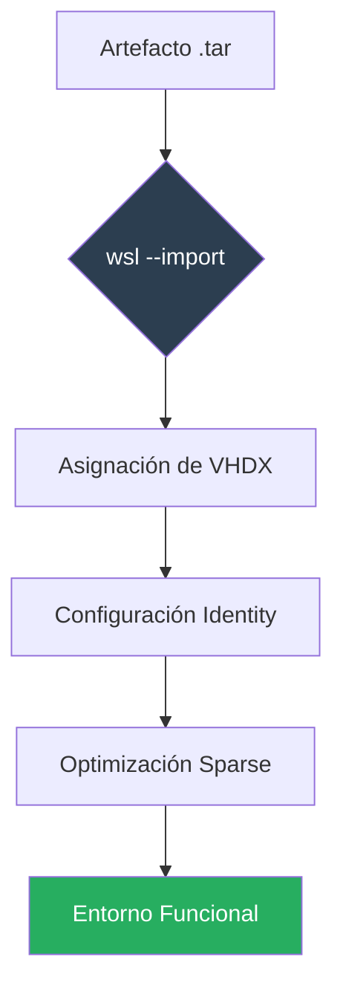

import { Steps, Aside, Badge, LinkCard, CardGrid } from '@astrojs/starlight/components';

Este protocolo describe la reconstrucción de instancias Linux utilizando artefactos `.tar`. Es el paso crítico tras una migración de host o una recuperación ante desastres (DR).

<Badge text="Escenario: Recuperación / Migración" variant="success" /> <Badge text="Host: Windows 10/11" variant="note" />

---

## 🔄 Flujo de Reconstrucción Operativa

El despliegue no es solo una importación de datos; requiere la rehidratación del sistema de archivos y la reconfiguración de la identidad del usuario para ser plenamente operativo.



---

## 🛠️ Procedimiento de Despliegue

Siga estos pasos desde una terminal de **PowerShell 7** con permisos de escritura en la unidad de destino.

<Steps>

1.  **Importación de la Distribución**
    
    Definimos el nombre de la instancia, el directorio de residencia del VHDX y el archivo fuente.

    ```powershell
    # Definir ruta de instancias (Storage Tier)
    $installRoot = "D:\WSL\instances"

    # Importar instancia (Ejemplo: Ubuntu)
    wsl --import Ubuntu "$installRoot\Ubuntu" ".\Ubuntu.tar" --version 2
    ```

2.  **Restablecimiento de Usuario Predeterminado**
    
    <Aside type="caution" title="Comportamiento Post-Import">
    Por diseño, WSL inicia como `root` tras una importación. Para volver a su usuario operativo (ej. `dzamo`), debe declarar la identidad.
    </Aside>

    Entre en la instancia y genere el archivo de configuración:
    ```bash
    # Ejecutar dentro de Linux
    sudo tee /etc/wsl.conf <<EOF
    [user]
    default=dzamo
    EOF
    ```
    *Nota: Ejecute `wsl --terminate <distro>` en PowerShell para aplicar los cambios.*

3.  **Habilitar Almacenamiento Dinámico (Sparse)**
    
    Para evitar que el archivo `.vhdx` reserve espacio innecesario en el host, habilitamos el modo *sparse*.

    ```powershell
    wsl --manage Ubuntu --set-sparse true
    ```

</Steps>

---

## 🔍 Verificación e Integridad

Valide que el inventario de WSL refleja los estados correctos y el uso de la arquitectura Versión 2:

```powershell
wsl --list --verbose
```

| Parámetro | Valor Esperado |
| :--- | :--- |
| **Versión** | 2 |
| **Estado** | Stopped / Running |
| **Usuario** | No-root (validado vía `whoami`) |

---

## 🔗 Artículos de la Serie

<CardGrid>
  <LinkCard 
    title="SOP: Exportación Base" 
    description="Cómo capturar el RootFS antes de la migración." 
    href="/es/tech-notes/howto/wsl-export-guide/" 
  />
  <LinkCard 
    title="Documentación Microsoft" 
    description="Comandos de importación de WSL." 
    href="https://learn.microsoft.com/en-us/windows/wsl/basic-commands#import-a-distribution" 
  />
</CardGrid>

**Autor:** `dzamo-sysadmin` | **Status:** Operativo post-migración
