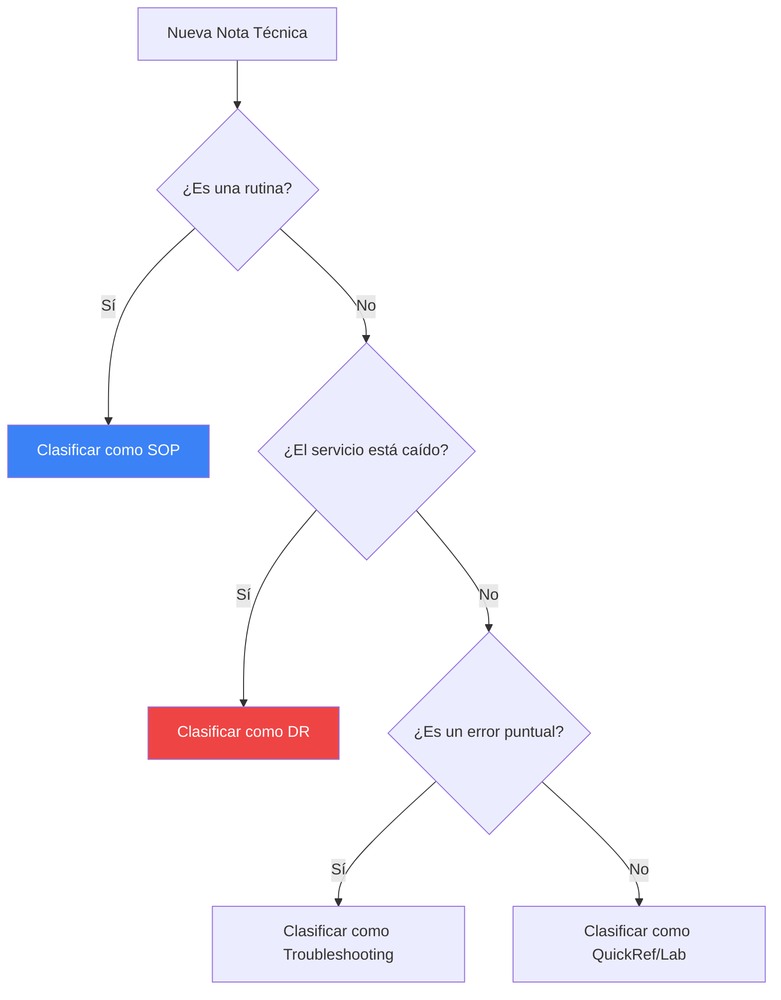

import { Steps, Aside, Badge, LinkCard, CardGrid, Icon } from '@astrojs/starlight/components';

En un entorno de **SysAdmin & DevOps**, la calidad de la documentación determina la velocidad de respuesta ante incidentes. Este sitio utiliza un sistema de categorización semántica para diferenciar el tipo de intervención requerida.

---

## 🏷️ Taxonomía de Contenidos

Utilizamos etiquetas (Badges) específicas para clasificar el nivel de criticidad y el propósito de cada nota técnica.

<CardGrid>
  <LinkCard 
    title="SOP (Standard Operating Procedure)" 
    description="Procedimientos preventivos y rutinarios para mantener la salud del sistema."
    href="#sop-preventivo"
  />
  <LinkCard 
    title="DR (Disaster Recovery)" 
    description="Protocolos reactivos de emergencia para restaurar servicios caídos."
    href="#dr-reactivo"
  />
</CardGrid>

### Definiciones Técnicas

| Sigla | Significado | Aplicación Práctica |
| :--- | :--- | :--- |
| **SOP** | Standard Operating Procedure | Instalaciones, backups programados, hardening. |
| **DR** | Disaster Recovery | Restauración tras pérdida de datos, migración de emergencia. |
| **TRB** | Troubleshooting | Resolución de errores específicos o bugs detectados. |
| **LAB** | Laboratory | Pruebas de concepto (PoC) y entornos experimentales. |

---

## 🛠️ Cómo elegir el marco adecuado

Para mantener la consistencia, cada nueva nota en este sitio debe pasar por el siguiente flujo de decisión:

---

## 🚀 Implementación en este Sitio

Puedes ver estos estándares aplicados en las siguientes guías de la serie WSL:

<Steps>

1.  **Fase Preventiva (SOP):**
    Generación de copias de seguridad consistentes del sistema de archivos.
    <LinkCard 
      title="Ver SOP: Exportación WSL" 
      href="/es/tech-notes/howto/wsl-export-guide/" 
      icon="save"
    />

2.  **Fase de Recuperación (DR):**
    Restauración del entorno tras una migración o fallo de sistema.
    <LinkCard 
      title="Ver DR: Restauración WSL" 
      href="/es/tech-notes/howto/wsl-restoration-guide/" 
      icon="refresh"
    />

</Steps>

<Aside type="tip" title="Mejora Continua">
Un **SOP** bien ejecutado reduce la probabilidad de tener que ejecutar un **DR**. La automatización (IaC) es el puente entre ambas categorías.
</Aside>

---

**Autor:** `dzamo-sysadmin` | **Revisión:** 2026.1 | **Categoría:** Gobernanza
