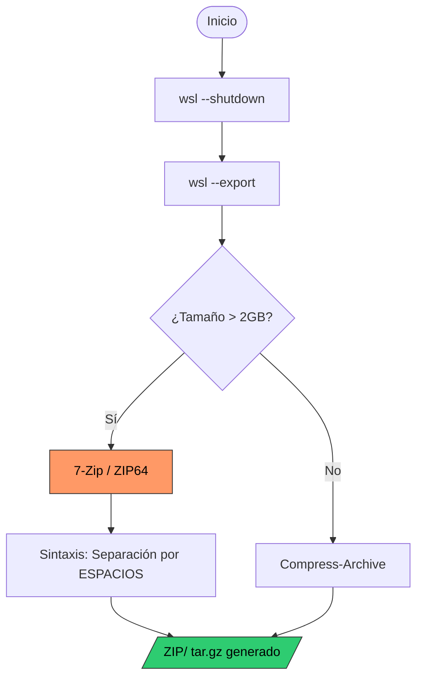

import { Steps, Aside, LinkCard, CardGrid, Badge } from '@astrojs/starlight/components';

Cuando las distribuciones de WSL exceden los **2GB**, el comando nativo de Windows `Compress-Archive` falla debido a las limitaciones del estándar Zip32. Para entornos de producción es imperativo utilizar herramientas que soporten **ZIP64** como **7-Zip**.

<Aside type="danger" title="Error Crítico de E/S">
`System.IO.IOException: Stream was too long.`  
Si encuentras este error en PowerShell, es la confirmación de que intentas procesar un volumen que excede la capacidad de las herramientas nativas.
</Aside>

---

## 🔄 Flujo de Empaquetado Robusto

La siguiente lógica de decisión asegura que el proceso de exportación y compresión mantenga la integridad de los datos según el tamaño del artefacto.



---

## 🛠️ Procedimiento de Ejecución (PowerShell 7)

Al invocar binarios externos como `7z.exe`, PowerShell maneja los argumentos de forma distinta a los cmdlets. El uso de un **Array Pattern** es la práctica recomendada para evitar errores de parseo.

<Steps>

1.  **Consistencia de Datos**
    
    Aseguramos que el archivo `.vhdx` no esté bloqueado.
    ```powershell
    wsl --shutdown
    ```

2.  **Preparación del Inventario de Archivos**
    
    Definimos las rutas en un array. PowerShell expandirá este objeto usando espacios automáticamente al invocar el binario.
    ```powershell
    $dest = "D:\10_Hot-Tier_Caliente\WSL\backups"
    
    $bundleFiles = @(
        "$dest\Ubuntu.tar",
        "$env:APPDATA\alacritty\alacritty.toml",
        "$dest\README_Ubuntu.md"
    )
    ```

3.  **Compresión con 7-Zip**
    
    Invocación directa asegurando que `7z.exe` está en el PATH del sistema.
    ```powershell
    7z.exe a -tzip "$dest\WSL_Ubuntu_Migration.zip" $bundleFiles
    ```

</Steps>

---

## ⚠️ Troubleshooting de Sintaxis

| Error Identificado | Causa Raíz | Acción Correctiva |
| :--- | :--- | :--- |
| `Stream was too long` | Límite Zip32 (2GB). | Migrar a **7-Zip** o **tar.exe**. |
| `Syntax is incorrect` | Uso de comas (`,`) en 7z. | Sustituir comas por **espacios**. |
| `Scan WARNINGS` | Rutas con espacios mal citadas. | Encapsular variables en comillas dobles. |

---

## 🔗 Referencias Cruzadas

<CardGrid>
  <LinkCard 
    title="SOP: Exportación Base" 
    description="Requisitos para generar el archivo .tar inicial." 
    href="/es/tech-notes/howto/wsl-export-guide/" 
  />
</CardGrid>

:::tip[Tip de Verificación]
Confirmar siempre el tamaño del bundle generado:  
`Get-ChildItem "$dest\*.zip" | Select-Object Name, @{N="GB"; E={$_.Length / 1GB}}`
:::

---
**Generado por:** dzamo-sysadmin | **Versión:** 1.1 | **Fix:** Mermaid Syntax
