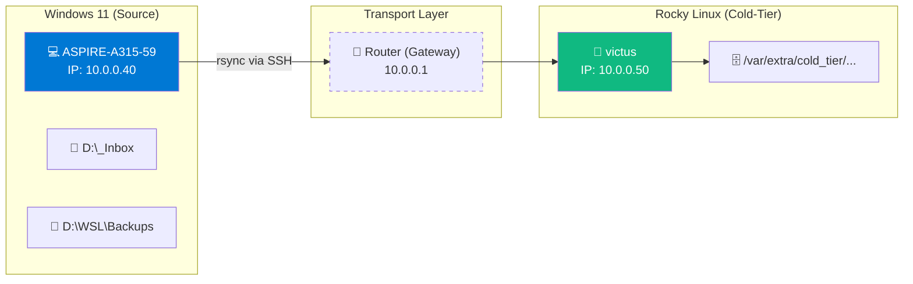

import { Steps, Aside, Badge, LinkCard, CardGrid } from '@astrojs/starlight/components';

Este flujo establece un mecanismo de transporte seguro para mover archivos desde una estación de trabajo local (**Hot-Tier**) hacia un nodo de almacenamiento remoto (**Cold-Tier**) basado en Rocky Linux.

<Badge text="Origen: Windows 11 (ASPIRE)" variant="note" /> <Badge text="Destino: Rocky Linux (victus)" variant="success" />

---

## 📐 Arquitectura del Enlace de Datos

Para generalizar este procedimiento, utilizaremos el segmento de red `10.0.0.0/8`. El tráfico viaja encapsulado a través de SSH para garantizar la integridad y seguridad de los datos.



---

## 🛠️ Configuración y Despliegue

### 1. Preparación del Entorno
Ambos sistemas deben contar con `rsync` versión 3.x para soportar protocolos modernos y delta-transfer.

*   **En Windows:** Se recomienda usar la versión incluida en *Git for Windows* o *MSYS2*.
*   **En Rocky Linux:** Se instala vía `dnf install rsync`.

### 2. Ejecución del Trasvase

<Steps>

1.  **Mapeo de Rutas en Windows**
    Al usar `rsync` en Windows (vía Bash/PowerShell), las letras de unidad deben direccionarse en formato POSIX:
    *   `D:\_Inbox` $\rightarrow$ `/d/_Inbox`
    *   `D:\10_Hot-Tier_Caliente\...` $\rightarrow$ `/d/10_Hot-Tier_Caliente/...`

2.  **Comando de Sincronización**
    Ejecute el siguiente bloque desde la terminal de Windows para iniciar el transporte:

    ```bash
    # Sincronización del Inbox y Backups de WSL
    rsync -avzP --relative \
      /d/_Inbox \
      /d/10_Hot-Tier_Caliente/WSL/Backups \
      dzamo@10.0.0.50:/var/extra/cold_tier/2026-01-29_ASPIRE-A315-59.win11_backup/_D
    ```

3.  **Explicación de Flags**
    *   `-a`: Modo archivo (preserva permisos y fechas).
    *   `-v`: Verbose (muestra progreso).
    *   `-z`: Compresión durante el transporte.
    *   `-P`: Mantiene archivos parcialmente transferidos y muestra barra de progreso.

</Steps>

---

## ⚠️ Consideraciones de Seguridad

<Aside type="caution" title="Permisos en Rocky Linux">
Asegúrese de que el usuario `dzamo` tenga permisos de escritura en `/var/extra/cold_tier/`. 
```bash
sudo chown -R dzamo:dzamo /var/extra/cold_tier/
```
</Aside>

<Aside type="tip" title="Optimización SSH">
Para evitar pedir contraseña en cada sincronización, configure una llave pública SSH:
`ssh-copy-id dzamo@10.0.0.50`
</Aside>

---

## 🔗 Relacionado: Continuidad de Datos

Este flujo es el complemento ideal para asegurar tus instancias de WSL exportadas previamente.

<CardGrid>
  <LinkCard 
    title="Cómo Exportar WSL" 
    description="Prepara tus imágenes .tar para este flujo de sincronización." 
    href="/es/tech-notes/howto/wsl-export-guide/" 
  />
  <LinkCard 
    title="Estándares DR" 
    description="Entiende por qué este flujo se clasifica como Cold-Tier." 
    href="/es/tech-notes/sop/documentation-standardization/" 
  />
</CardGrid>

---
**Autor:** `dzamo-sysadmin` | **Tier:** Almacenamiento Frío | **Red:** 10.0.0.0/8
